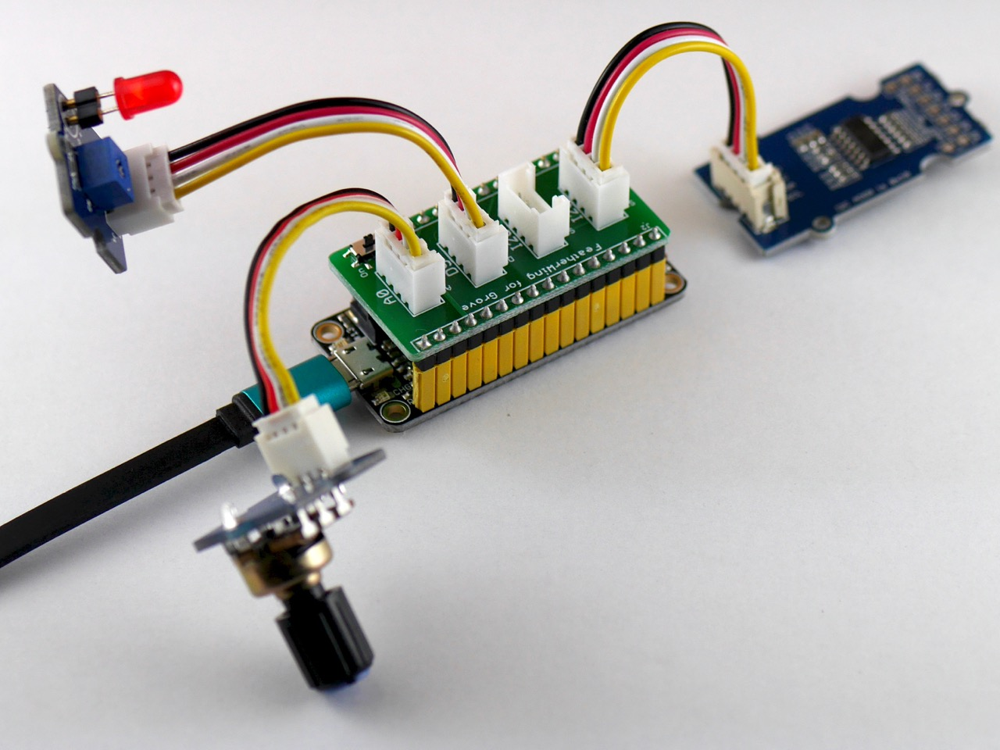

# FeatherWing for Grove

A bridge between the [**Grove**](http://www.seeedstudio.com/wiki/Category:Grove) family by the Seeed Studio and [**Feather**](https://www.adafruit.com/feather) by the Adafruit Industries.

## Bill of Materials

|Part/Designator|Manufacture Part Number/Seeed SKU|Quantity|
|---------------|---------------------------------|--------|
|PCB||1|
|J1|Digi-Key: [S1011EC-12-ND](http://www.digikey.com/product-search/en?keywords=S1011EC-12-ND)|1|
|J2|Digi-Key: [S1011EC-16-ND](http://www.digikey.com/product-search/en?keywords=S1011EC-16-ND)|1|
|J3,J4,J5,J6|Seeed SKU: [320110033](http://www.seeedstudio.com/depot/index.php?main_page=opl_info&opl_id=4)|4|
|SW1|Seeed SKU: [311030001](http://www.seeedstudio.com/depot/index.php?main_page=opl_info&opl_id=625)|1|

## How to 'Compile'?

Place an order at the [Fusion PCBA prototype](http://www.seeedstudio.com/service/index.php?r=pcb) service.

## Compatible Grove Modules

* Sensors
  * [Grove - Switch(P)](http://www.seeedstudio.com/wiki/Grove_-_Switch(P))
  * [Grove - Rotary Angle Sensor](http://www.seeedstudio.com/wiki/Grove_-_Rotary_Angle_Sensor)
  * [Grove - Slide Potentiometer](http://www.seeedstudio.com/wiki/Grove_-_Slide_Potentiometer)
  * [Grove - Touch Sensor](http://www.seeedstudio.com/wiki/Grove_-_Touch_Sensor)
  * [Grove - Light Sensor](http://www.seeedstudio.com/wiki/Grove_-_Light_Sensor)
  * [Grove - Single Axis Analog Gyro](http://www.seeedstudio.com/wiki/Grove_-_Single_Axis_Analog_Gyro)
  * [Grove - Button](http://www.seeedstudio.com/wiki/Grove_-_Button)
  * [Grove - Q Touch Sensor](https://seeedstudio.com/Grove-Q-Touch-Sensor-p-1854.html)
* Actuators
  * [Grove - LED Socket Kit](http://www.seeedstudio.com/wiki/Grove_-_LED)
  * [Grove - Buzzer](http://www.seeedstudio.com/wiki/Grove_-_Buzzer)
  * [Grove - Vibration Motor](http://www.seeedstudio.com/wiki/Grove_-_Vibration_Motor)
  * [Grove - Servo](http://www.seeedstudio.com/wiki/Grove_-_Servo)

# License Information

This design document is licensed by Shigeru Kobayashi under the terms of the [Creative Commons Attribution-ShareAlike 4.0 International Public License](http://creativecommons.org/licenses/by-sa/4.0/).